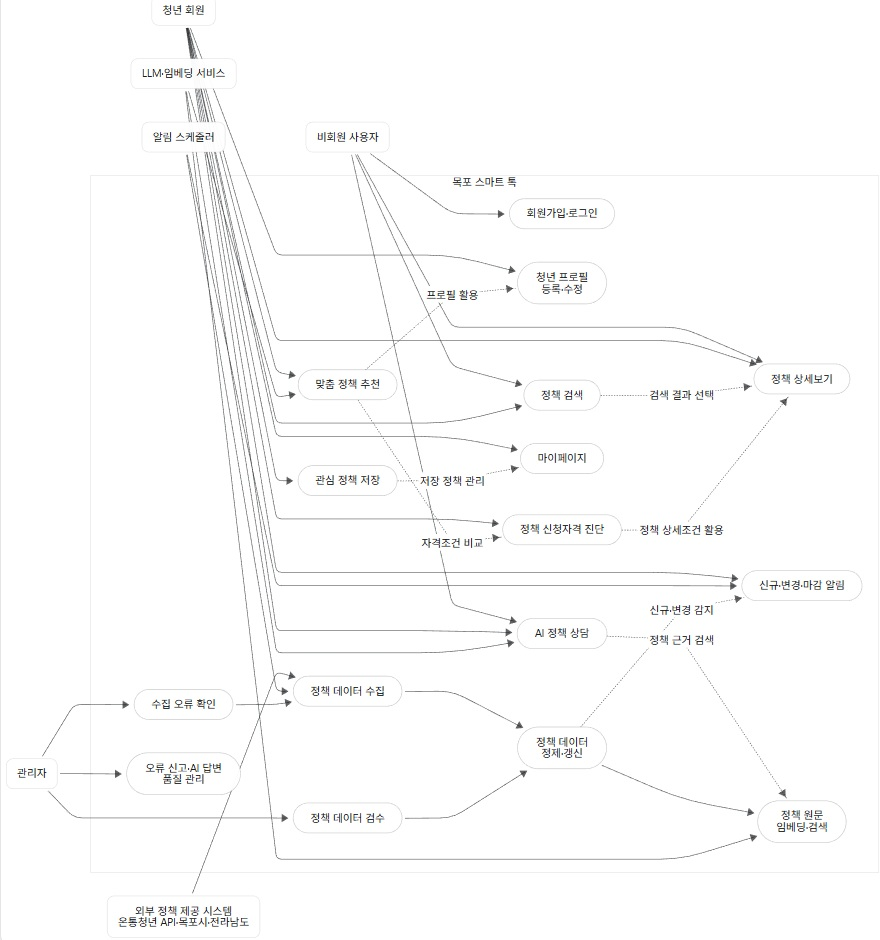

# 요구사항 정의서

| 과제명 : |
| --- |
| 목포 청년 알려드림 |

| 발표회 날짜로 작성2026. 00. 00. |

## 개요

□ 문서의 목적

본 문서는 LLM·RAG 기반 목포 청년 맞춤형 정책 추천 서비스인 ‘목포 스마트 톡’ 개발의 요구사항을 정의한 문서이다.

본 서비스는 온통청년 Open API와 목포시·전라남도의 공식 청년정책 공고를 활용하여 정책 정보를 수집하고, 사용자의 나이, 거주지, 취업 상태, 소득, 학력, 가구 상황 및 관심 분야를 반영한 맞춤형 청년정책 추천을 제공하는 것을 목표로 한다.

또한 정책 원문을 기반으로 답변하는 RAG 방식의 AI 챗봇을 통해 복잡한 정책 내용을 이해하기 쉽게 설명하고, 신청자격, 신청기간, 준비서류, 신청방법 및 원문 링크를 안내한다.

정책을 확인한 이후에는 공고와 첨부 양식에서 신청 문항과 증빙서류를 구조화하고, 선택적 프로필 자동 채움, AI 서술형 초안, 제출 전 검증 및 작성본 내보내기를 제공해 사용자의 신청 준비를 지원한다.

이 요구사항 정의서는 ‘목포 스마트 톡’ 웹서비스 개발을 위한 설계문서 작성의 기초자료로 활용한다. 사용자 유스케이스를 기반으로 소프트웨어가 제공해야 할 기능 및 화면에서 필수적으로 구현되어야 할 요구사항을 구체적으로 기술하고 정의한다.

본 문서의 요구사항은 가능한 구체적이고 간결하게 표현하며, 개발 완료 후 기능시험을 통해 충족 여부를 확인할 수 있도록 작성한다. 본 문서의 주요 사용자는 프로젝트 기획자, 프론트엔드/백엔드 개발자, 데이터 담당자, AI 기능 개발자 및 테스트 담당자이다.

□ 요구사항 및 문서의 범위

본 문서는 다음 항목을 범위로 한다.

- 사용자 및 외부 시스템 액터 정의

- 사용자 유스케이스와 유스케이스별 상세 흐름

- 회원·프로필·정책 검색·관심 정책 등 공통 기능 요구사항

- 맞춤 추천·자격 진단·RAG 챗봇·정책 요약 등 AI 기능 요구사항

- 신청서류 체크리스트·자동 채움·문항 초안·검증·내보내기 등 서류 작성 지원 요구사항

- 청년정책 수집·정제·갱신 등 데이터 요구사항

- 관리자 기능 요구사항

서비스의 초기 사용자 범위는 목포 거주 청년으로 한다. 정책 데이터 범위는 목포시 정책에 한정하지 않고, 목포 거주 청년에게 적용되는 전라남도 및 전국 단위의 일자리, 주거, 교육·직업훈련, 금융·복지, 창업 및 참여·문화 정책까지 포함한다.

정책 신청 자체를 대신 처리하거나 최종 수혜 자격을 법적으로 확정하는 기능은 개발 범위에서 제외한다. 서비스의 자격 진단 결과와 작성본은 참고정보로 제공하며, 최종 신청 가능 여부와 제출 내용은 반드시 정책 담당기관의 공식 공고를 통해 사용자가 확인하도록 안내한다.

서류 작성 지원 범위는 정책 원문과 첨부 양식에 기반한 준비서류 체크리스트 생성, 사용자 동의를 거친 프로필 자동 채움, 사용자 제공 사실에 근거한 서술형 문항 초안, 증빙자료 준비 상태 관리, 누락·형식·글자 수 점검, 임시저장 및 PDF·DOCX 내보내기까지로 한다. 기관 사이트 자동 로그인, 전자서명, 증명서 자동 발급, 신청서 자동 제출 및 HWP 원본 양식의 완전한 편집은 제외한다.

## 유스케이스

□ 액터 정의

| 액터 |
| --- |
| 설명 |
| 비회원 사용자 |
| 회원가입 전 정책 검색, 정책 상세보기 및 제한된 AI 상담 기능을 이용하는 사용자 |
| 청년 회원 |
| 프로필을 등록하고 맞춤 정책 추천, 자격 진단, AI 상담, 관심 정책 및 알림 기능을 이용하는 사용자 |
| 관리자 |
| 정책 데이터, 사용자 신고, 수집 상태, 공고 변경 및 AI 답변 품질을 관리하는 운영자 |
| 외부 정책 제공 시스템 |
| 온통청년 Open API, 목포시·전라남도 공식 공고 등 정책 데이터를 제공하는 외부 시스템 |
| LLM, 임베딩 서비스 |
| 정책 원문 임베딩, 질의 의도 파악, 정책 요약 및 근거 기반 답변 생성에 사용되는 외부 AI 서비스 |
| 알림 스케쥴러 |
| 신규 정책, 정책 변경 및 신청 마감일을 주기적으로 확인해 사용자에게 알림을 생성하는 시스템 |
| 문서 변환 모듈 |
| 확인된 신청서 데이터를 웹 편집 화면과 PDF·DOCX 작성본으로 변환하고 내보내기 파일을 생성하는 내부 시스템 |

□ 유스케이스 다이어그램

□ 유스케이스 명세

## 유스케이스 1 : 회원가입 및 프로필 등록

| 유스케이스 이름 |
| --- |
| 회원가입 및 청년 프로필 등록 |
| 유스케이스 ID 규칙프로젝트명약어_번호ex) HRGG_100유스케이스 ID |
| MST_100 |
| 관련 요구사항 |
| FR-AD-001, FR-AD-002, FR-AD-003 |
| 우선순위 |
| 높음 |
| 선행조건 |
| 사용자가 서비스에 접속한 상태여야 한다 |
| 관련 액터 |
| 비회원 사용자, 청년 회원 |
| 이벤트 흐름 |
| 1. 사용자가 회원가입을 선택한다. 2. 필수 정보를 입력하고 이용약관 및 개인정보 수집에 동의한다. 3. 시스템이 입력값의 형식과 중복 여부를 확인한다. 4. 회원가입 완료 후 프로필 입력 화면을 제공한다. 5. 사용자가 나이, 거주지, 취업 상태, 소득구간, 학력, 가구 상황 및 관심 분야를 입력한다. 6. 시스템이 프로필을 저장한다. |
| 예외 흐름 |
| 이미 사용 중인 아이디이거나 필수 입력값이 누락된 경우 오류 메시지를 표시하고 저장하지 않는다. |
| 종료조건 |
| 회원 계정과 청년 프로필이 정상적으로 저장된다. |

## 유스케이스 2 : 맞춤 정책 추천

| 유스케이스 이름 |
| --- |
| 프로필 기반 맞춤 정책 추천 |
| 유스케이스 ID 규칙프로젝트명약어_번호ex) HRGG_100유스케이스 ID |
| MST_200 |
| 관련 요구사항 |
| FR-AI-001, FR-AI-002, FR-DT-003 |
| 우선순위 |
| 높음 |
| 선행조건 |
| 사용자가 로그인하고 필수 프로필을 입력한 상태여야 한다. |
| 관련 액터 |
| 청년 회원, LLM·임베딩 서비스 |
| 이벤트 흐름 |
| 1. 사용자가 맞춤 정책 메뉴에 접속한다. 2. 시스템이 프로필과 정책 자격조건을 비교한다. 3. 명백히 조건이 맞지 않는 정책을 제외한다. 4. 관심 분야와 정책 관련도를 기준으로 결과를 정렬한다. 5. 추천 이유와 함께 정책 목록을 표시한다. |
| 예외 흐름 |
| 필수 프로필이 누락된 경우 부족한 항목을 안내하고 프로필 수정 화면으로 이동할 수 있도록 한다. |
| 종료조건 |
| 사용자 조건에 적합한 정책과 추천 이유가 화면에 표시된다. |

## 유스케이스 3 : 정책 신청자격 진단

| 유스케이스 이름 |
| --- |
| 정책 신청자격 진단 |
| 유스케이스 ID 규칙프로젝트명약어_번호ex) HRGG_100유스케이스 ID |
| MST_300 |
| 관련 요구사항 |
| FR-AI-003, FR-AI-004 |
| 우선순위 |
| 높음 |
| 선행조건 |
| 사용자가 진단할 정책을 선택하고 프로필을 등록한 상태여야 한다. |
| 관련 액터 |
| 청년 회원 |
| 이벤트 흐름 |
| 1. 사용자가 정책 상세화면에서 자격 진단을 선택한다. 2. 시스템이 연령, 거주지, 취업 상태, 소득, 학력 및 기타 조건을 프로필과 비교한다. 3. 조건별 판정 근거를 표시한다. 4. 전체 결과를 ‘신청 가능’, ‘추가 확인 필요’, ‘대상 아님’ 중 하나로 표시한다 |
| 예외 흐름 |
| 정책 원문에서 조건을 명확히 구조화할 수 없는 경우 ‘추가 확인 필요’로 표시하고 담당기관 문의처와 원문 링크를 제공한다. |
| 종료조건 |
| 조건별 진단 결과와 최종 참고 판정이 표시된다. |

## 유스케이스 4 : AI 정책 상담

| 유스케이스 이름 |
| --- |
| RAG 기반 AI 정책 상담 |
| 유스케이스 ID 규칙프로젝트명약어_번호ex) HRGG_100유스케이스 ID |
| MST_400 |
| 관련 요구사항 |
| FR-AI-005, FR-AI-006, FR-AI-007 |
| 우선순위 |
| 높음 |
| 선행조건 |
| 정책 데이터와 정책 원문이 검색 가능한 상태여야 한다. |
| 관련 액터 |
| 비회원 사용자, 청년 회원, LLM·임베딩 서비스 |
| 이벤트 흐름 |
| 1. 사용자가 자연어로 정책 관련 질문을 입력한다. 2. 시스템이 질문의 핵심 의도와 조건을 분석한다. 3. FAISS HNSW 인덱스에서 관련 정책 원문 청크를 검색하고 MySQL에서 정책 원문·메타데이터를 조회한다. 4. 검색된 근거와 사용자 프로필을 조합해 답변을 생성한다. 5. 답변과 함께 정책명, 담당기관, 신청기간 및 원문 링크를 표시한다. |
| 예외 흐름 |
| 관련 근거를 찾지 못하거나 정보가 불충분한 경우 임의로 답변하지 않고 ‘확인 가능한 정책정보가 부족합니다’라는 안내와 재검색 방법을 제공한다. |
| 종료조건 |
| 정책 원문에 근거한 답변과 출처가 사용자에게 제공된다. |

## 유스케이스 5 : 정책 검색 및 상세보기

| 유스케이스 이름 |
| --- |
| 청년정책 검색 및 상세보기 |
| 유스케이스 ID 규칙프로젝트명약어_번호ex) HRGG_100유스케이스 ID |
| MST_500 |
| 관련 요구사항 |
| FR-AD-004, FR-AD-005 |
| 우선순위 |
| 높음 |
| 선행조건 |
| 정책 데이터가 시스템에 저장되어 있어야 한다. |
| 관련 액터 |
| 비회원 사용자, 청년 회원 |
| 이벤트 흐름 |
| 1. 사용자가 검색어 또는 검색조건을 입력한다. 2. 시스템이 조건에 맞는 정책 목록을 조회한다. 3. 사용자가 정책을 선택한다. 4. 시스템이 지원내용, 신청대상, 신청기간, 신청방법, 제출서류, 담당기관 및 원문 링크를 표시한다. |
| 예외 흐름 |
| 검색 결과가 없는 경우 검색조건을 완화하거나 AI 상담을 이용하도록 안내한다. |
| 종료조건 |
| 검색 결과 또는 선택한 정책의 상세정보가 표시된다. |

## 유스케이스 6 : 관심 정책 및 알림 관리

| 유스케이스 이름 |
| --- |
| 관심 정책 저장 및 알림 관리 |
| 유스케이스 ID 규칙프로젝트명약어_번호ex) HRGG_100유스케이스 ID |
| MST_600 |
| 관련 요구사항 |
| FR-AD-006, FR-AD-007, FR-AD-008 |
| 우선순위 |
| 중간 |
| 선행조건 |
| 사용자가 로그인한 상태여야 한다. |
| 관련 액터 |
| 청년 회원, 알림 스케줄러 |
| 이벤트 흐름 |
| 1. 사용자가 정책 상세화면에서 관심 정책 저장을 선택한다. 2. 시스템이 해당 정책을 위시리스트에 저장한다. 3. 사용자가 알림 수신 여부를 설정한다. 4. 시스템이 정책 내용 변경, 신규 유사 정책 또는 신청 마감 임박을 감지한다. 5. 시스템이 알림을 생성해 마이페이지에 표시한다. |
| 예외 흐름 |
| 이미 저장된 정책이면 중복 저장하지 않고 기존 저장 상태를 표시한다. |
| 종료조건 |
| 관심 정책과 알림 설정이 저장된다. |

## 유스케이스 7 : 정책 데이터 수집 및 갱신

| 유스케이스 이름 |
| --- |
| 청년정책 데이터 수집 및 갱신 |
| 유스케이스 ID 규칙프로젝트명약어_번호ex) HRGG_100유스케이스 ID |
| MST_700 |
| 관련 요구사항 |
| FR-DT-001, FR-DT-002, FR-DT-003, FR-DT-004 |
| 우선순위 |
| 높음 |
| 선행조건 |
| 외부 API 인증정보 또는 수집 대상 공식 사이트 정보가 등록되어 있어야 한다. |
| 관련 액터 |
| 외부 정책 제공 시스템, 관리자, 알림 스케줄러 |
| 이벤트 흐름 |
| 1. APScheduler가 정해진 시간에 별도 수집 워커를 실행한다. 2. 워커가 HTTPX로 온통청년 Open API에서 정책 데이터를 비동기로 조회한다. 3. API에 없는 목포시청 청년지원사업·목포청년센터 누리·전라남도의 공식 청년정책 공고만 보완 수집한다. 4. Pandas·정규표현식으로 데이터를 공통 형식으로 정제한다. 5. 기존 데이터와 비교해 신규·변경 여부를 판정한다. 6. 서비스 데이터와 정책 원문·임베딩 메타데이터는 MySQL에 갱신하고, 검색용 FAISS HNSW 인덱스를 재생성한다. |
| 예외 흐름 |
| 외부 시스템 오류가 발생하면 기존 데이터를 유지하고 오류 내용을 관리자 로그에 기록한다. |
| 종료조건 |
| 신규·변경 정책이 저장되고 최종 수집일과 원문 출처가 기록된다. |

## 유스케이스 8 : 정책 데이터 관리자 검수

| 유스케이스 이름 |
| --- |
| 정책 데이터 및 오류정보 관리 |
| 유스케이스 ID 규칙프로젝트명약어_번호ex) HRGG_100유스케이스 ID |
| MST_800 |
| 관련 요구사항 |
| FR-MG-001, FR-MG-002, FR-MG-003 |
| 우선순위 |
| 중간 |
| 선행조건 |
| 관리자가 관리자 권한으로 로그인한 상태여야 한다. |
| 관련 액터 |
| 관리자 |
| 이벤트 흐름 |
| 1. 관리자가 수집 현황과 변경 정책 목록을 확인한다. 2. 자동 정제 결과와 원문을 비교한다. 3. 잘못된 정책정보를 수정하거나 비공개 처리한다. 4. 사용자 오류신고와 AI 답변 로그를 확인한다. 5. 검수 결과를 저장한다. |
| 예외 흐름 |
| 수정할 정책 원문이 삭제된 경우 해당 정책을 ‘확인 필요’ 상태로 전환한다. |
| 종료조건 |
| 검수 결과와 처리 이력이 저장된다. |

## 유스케이스 9 : 신청서류 작성 지원

| 유스케이스 이름 |
| --- |
| 정책 신청서류 준비 및 작성 |
| 유스케이스 ID 규칙프로젝트명약어_번호ex) HRGG_100유스케이스 ID |
| MST_900 |
| 관련 요구사항 |
| FR-DS-001 ~ FR-DS-014 |
| 우선순위 |
| 높음 |
| 선행조건 |
| 사용자가 로그인하고 정책 상세화면에서 최종 확인일과 공식 원문을 확인한 상태여야 한다. |
| 관련 액터 |
| 청년 회원, LLM·임베딩 서비스, 문서 변환 모듈 |
| 이벤트 흐름 |
| 1. 사용자가 ‘신청 준비 시작’을 선택한다. 2. 시스템이 정책 원문과 첨부 양식에서 신청 문항, 필수·선택 서류, 발급처, 유효기간, 제출형식 및 글자 수 제한을 추출한다. 3. 시스템이 각 항목의 원문 근거와 최종 확인일을 표시하고 사용자가 추출 결과를 확인·수정한다. 4. 사용자가 자동 채움에 사용할 프로필 항목을 선택하고 동의한다. 5. 시스템이 동의받은 값만 신청서에 반영하며, 알 수 없는 값은 ‘확인 필요’로 남긴다. 6. 사용자가 문항별 사실과 경험을 입력하면 AI가 정책 목적과 분량에 맞는 서술형 초안을 제안한다. 7. 사용자가 초안을 수정·확정하고 증빙서류 준비 상태를 기록한다. 8. 시스템이 필수값, 입력 형식, 글자 수, 날짜 및 항목 간 일관성을 검사한다. 9. 사용자가 최종 확인 후 작성본을 PDF 또는 DOCX로 내려받는다. 10. 시스템이 공식 신청 사이트 링크와 최종 제출 전 확인 안내를 제공한다. |
| 예외 흐름 |
| 원문이나 양식을 불러오지 못하거나 자동 추출 신뢰도가 낮은 경우 자동 입력을 중단하고 원문 다운로드 링크와 수동 입력 화면을 제공한다. 정책 내용 또는 양식 버전이 변경되면 기존 작성본을 유지하되 변경 항목을 표시하고 재확인을 요구한다. 지원하지 않는 HWP 양식은 원본 다운로드 링크와 웹 작성 참고본을 제공한다. |
| 종료조건 |
| 정책별 체크리스트와 신청서 작성본이 저장되고, 검증 결과 확인 후 지원 형식으로 내보낼 수 있다. 공식 기관 제출은 사용자가 직접 수행한다. |

3. 기능 요구사항

□ 애플리케이션 공통 기능

| 기능 요구사항 ID 규칙FR-업무구분코드-번호ex) FR-AD-001*업무구분코드AD : Application Development (애플리케이션 공통 기능)AI : Artificial Intelligence (AI 활용 기능)CM : Commerce (결제, 장바구니 등 커머스 기능)등 프로젝트 기능에 알맞은 업무구분 코드 정의하고 사용ID |
| --- |
| 요구사항명칭 |
| 설명 |
| 우선순위 |
| FR-AD-001 |
| 회원가입 |
| 시스템은 아이디, 비밀번호 및 필수 동의정보를 입력받아 회원 게정을 생성해야 한다 |
| 높음 |
| FR-AD-002 |
| 로그인, 로그아웃 |
| 시스템은 등록된 게정으로 로그인과 로그아웃 기능을 제공해야 한다 |
| 높음 |
| FR-AD-003 |
| 프로필 관리 |
| 사용자는 나이, 거주지, 거주기간, 취업 상태, 소득구간, 학력, 가구 상황 및 관심 분야를 등록·조회·수정할 수 있어야 한다. 서류 자동 채움을 이용하는 회원은 성명, 생년월일, 연락처 및 상세 주소를 선택적으로 등록·수정·삭제할 수 있어야 한다. |
| 높음 |
| FR-AD-004 |
| 정책 통합검색 |
| 사용자는 정책명과 키워드로 청년정책을 검색할 수 있어야 한다. |
| 높음 |
| FR-AD-005 |
| 정책 조건검색 |
| 사용자는 지역, 연령, 정책 분야, 취업 상태, 소득, 학력 및 모집 상태로 정책을 필터링할 수 있어야 한다. |
| 높음 |
| FR-AD-006 |
| 정책 상세보기 |
| 시스템은 정책의 지원내용, 자격조건, 신청기간, 신청방법, 제출서류, 담당기관, 문의처, 원문 링크 및 최종 확인일을 표시해야 한다. |
| 높음 |
| FR-AD-007 |
| 관심 정책 저장 |
| 로그인 사용자는 정책을 위시리스트에 저장하거나 삭제할 수 있어야 한다. |
| 중간 |
| FR-AD-008 |
| 마이페이지 |
| 사용자는 프로필, 관심 정책, 알림, 최근 상담, 자격 진단 결과 및 진행 중인 신청 준비 건을 확인할 수 있어야 한다. |
| 중간 |
| FR-AD-009 |
| 정책 원문 이동 |
| 사용자는 정책 상세화면과 AI 답변에서 공식 원문 페이지로 이동할 수 있어야 한다. |
| 높음 |

□ AI 활용 기능

| 기능 요구사항 ID 규칙FR-업무구분코드-번호ex) FR-AD-001*업무구분코드AD : Application Development (애플리케이션 공통 기능)AI : Artificial Intelligence (AI 활용 기능)CM : Commerce (결제, 장바구니 등 커머스 기능)등 프로젝트 기능에 알맞은 업무구분 코드 정의하고 사용ID |
| --- |
| 요구사항명칭 |
| 설명 |
| 우선순위 |
| FR-AI-001 |
| 프로필 기반 정책 필터링 |
| 시스템은 사용자 프로필과 정책 자격조건을 비교해 명백히 부적합한 정책을 추천 목록에서 제외해야 한다. |
| 높음 |
| FR-AI-002 |
| 맞춤 정책 추천 |
| 시스템은 사용자 조건, 관심 분야 및 정책 관련도를 반영해 추천 정책을 정렬해야 한다. |
| 높음 |
| FR-AI-003 |
| 자격조건별 판정 |
| 시스템은 연령, 거주지, 취업 상태, 소득, 학력 및 기타 조건별 판정 결과를 제공해야 한다. |
| 높음 |
| FR-AI-004 |
| 자격진단 결과 구분 |
| 시스템은 진단 결과를 ‘신청 가능’, ‘추가 확인 필요’, ‘대상 아님’으로 구분해 표시해야 한다. |
| 높음 |
| FR-AI-005 |
| 자연어 정책상담 |
| 사용자는 일상적인 문장으로 정책 관련 질문을 입력할 수 있어야 한다. |
| 높음 |
| FR-AI-006 |
| RAG 기반 답변 |
| 시스템은 검색된 정책 원문을 근거로 답변을 생성해야 하며, 근거가 없는 내용을 사실처럼 생성해서는 안 된다. |
| 높음 |
| FR-AI-007 |
| 답변 출처 표시 |
| AI 답변에는 관련 정책명, 담당기관, 신청기간, 원문 링크를 함께 표시해야 한다. |
| 높음 |
| FR-AI-008 |
| 불확실성 안내 |
| 정책 조건이 모호하거나 근거가 부족한 경우 시스템은 ‘추가 확인 필요’라는 안내를 표시해야 한다. |
| 높음 |
| FR-AI-009 |
| 정책 요약 |
| 시스템은 긴 정책 공고를 지원내용, 신청대상, 신청기간, 신청방법 및 준비서류 중심으로 요약해야 한다. |
| 중간 |
| FR-AI-010 |
| 카드뉴스형 정보 제공 |
| 시스템은 정책 핵심정보를 화면에서 쉽게 확인할 수 있는 카드 형태로 제공해야 한다. |
| 중간 |
| FR-AI-011 |
| 추천 이유 표시 |
| 추천 결과에는 연령, 지역, 관심 분야 등 해당 정책이 추천된 주요 이유를 표시해야 한다. |
| 중간 |

□ 서류 작성 지원 기능

*업무구분코드 DS : Document Support (신청서류 작성 지원)

| ID |
| --- |
| 요구사항명칭 |
| 설명 |
| 우선순위 |
| FR-DS-001 |
| 신청 준비 건 생성 |
| 로그인 사용자는 정책 상세화면에서 ‘신청 준비 시작’을 선택해 정책별 신청 준비 건을 생성할 수 있어야 한다. 시스템은 정책명, 공고 버전, 원문 URL 및 최종 확인일을 함께 저장해야 한다. |
| 높음 |
| FR-DS-002 |
| 신청 항목 추출 |
| 시스템은 정책 원문과 첨부 양식에서 신청 문항, 필수 여부, 입력 형식 및 글자 수 제한을 추출하고 항목별 원문 근거를 표시해야 한다. 추출하지 못한 값은 임의로 생성하지 않고 ‘확인 필요’로 표시해야 한다. |
| 높음 |
| FR-DS-003 |
| 증빙서류 체크리스트 |
| 시스템은 필수·선택 증빙서류와 발급처, 유효기간, 제출형식 및 주의사항을 체크리스트로 제공해야 한다. 사용자는 각 항목을 미준비·준비 중·완료·해당 없음으로 변경하고 메모할 수 있어야 한다. |
| 높음 |
| FR-DS-004 |
| 추출 결과 확인 및 수정 |
| 사용자는 자동 추출된 신청 문항과 증빙서류 정보를 원문과 비교해 확인·수정할 수 있어야 하며, 시스템은 사용자의 확인 여부를 기록해야 한다. |
| 높음 |
| FR-DS-005 |
| 선택적 프로필 자동 채움 |
| 시스템은 자동 채움 전에 사용할 프로필 항목과 입력 위치를 미리 보여주고 동의를 받아야 한다. 동의받은 최신 프로필 값만 반영하며, 값이 없거나 매핑이 불확실한 항목은 비워 두고 확인을 요청해야 한다. |
| 높음 |
| FR-DS-006 |
| 신청 문항 편집 |
| 사용자는 웹 편집 화면에서 자동 채움 값과 직접 입력한 답변을 조회·수정·확정할 수 있어야 하며, 필수 문항과 글자 수를 실시간으로 확인할 수 있어야 한다. |
| 높음 |
| FR-DS-007 |
| AI 서술형 초안 |
| 시스템은 지원동기·활동계획 등 서술형 문항에 대해 정책 목적, 문항 요구사항, 분량 제한 및 사용자가 입력한 사실만을 근거로 초안을 제안해야 한다. 확인되지 않은 경력·수치·자격을 생성해서는 안 되며, 부족한 정보는 사용자에게 추가 입력을 요청하거나 빈칸으로 남겨야 한다. |
| 높음 |
| FR-DS-008 |
| AI 초안 사용자 확정 |
| AI가 생성한 문장은 ‘AI 초안’으로 구분해 표시해야 하며, 사용자가 직접 검토·수정하고 확정하기 전에는 최종 작성본에 포함해서는 안 된다. |
| 높음 |
| FR-DS-009 |
| 제출 전 검증 |
| 시스템은 필수 문항 누락, 필수 증빙서류의 준비 미완료, 날짜·연락처 등 입력 형식, 글자 수 초과 및 신청서 내부 값의 불일치를 검사해야 한다. 검증 결과는 제출을 방해하는 오류와 사용자가 판단할 권고로 구분해 표시해야 한다. |
| 높음 |
| FR-DS-010 |
| 임시저장 및 버전 복구 |
| 시스템은 작성 중인 신청서를 자동 임시저장하고 최근 수정시각을 표시해야 한다. 사용자는 저장된 신청 준비 건을 다시 열고 이전 저장 버전으로 복구할 수 있어야 한다. |
| 중간 |
| FR-DS-011 |
| 작성본 미리보기 및 내보내기 |
| 사용자는 확정한 내용을 미리보고 PDF 또는 DOCX로 내려받을 수 있어야 한다. 원본 양식을 완전히 재현하지 못한 결과물에는 ‘작성 참고본’임을 표시하고 공식 원본 양식 링크를 함께 제공해야 한다. |
| 높음 |
| FR-DS-012 |
| 공고·양식 변경 대응 |
| 신청 준비 이후 정책 내용이나 양식 버전이 변경된 경우 시스템은 기존 작성본을 보존하고 변경된 항목을 표시해야 하며, 내보내기 전에 사용자에게 재확인을 요구해야 한다. |
| 높음 |
| FR-DS-013 |
| 작성 데이터 보호 및 삭제 |
| 신청 준비 건과 내보내기 파일은 소유한 로그인 사용자만 접근할 수 있어야 하며 전송 및 저장 과정에서 보호되어야 한다. 사용자가 준비 건을 삭제하면 관련 답변, 체크 상태 및 임시 생성 파일도 함께 삭제해야 한다. |
| 높음 |
| FR-DS-014 |
| 최종 확인 및 제출 범위 안내 |
| 시스템은 작성본 생성 전 ‘내용의 정확성은 사용자가 최종 확인해야 하며 공식 제출은 완료되지 않았다’는 안내와 확인 절차를 제공하고, 내보내기 후 공식 신청 페이지 링크를 표시해야 한다. |
| 높음 |

□ 서류 작성 지원 인수 기준

- 지원 대상으로 정한 테스트 공고에서 신청 문항과 필수·선택 증빙서류가 원문 근거와 함께 생성되고, 사용자가 추출 결과를 직접 수정할 수 있어야 한다.

- 자동 채움 동의를 취소한 항목은 작성본에 반영되지 않아야 하며, 프로필에 없는 값은 임의로 채워지지 않아야 한다.

- AI 초안에 사용자가 제공하지 않은 경력·수치·자격이 포함되지 않아야 하고, 사용자 확정 전에는 최종 작성본에 포함되지 않아야 한다.

- 필수 문항 미입력, 필수 증빙서류 준비 미완료, 글자 수 초과 및 잘못된 입력 형식을 각각 재현했을 때 해당 항목과 해결 방법이 표시되어야 한다.

- 공고나 양식 버전 변경 시 기존 작성 내용은 유지되고 변경 항목에 재확인 표시가 나타나야 한다.

- 다른 사용자 계정으로 신청 준비 건 URL에 접근할 수 없어야 하며, 삭제한 준비 건과 임시 생성 파일은 다시 조회하거나 내려받을 수 없어야 한다.

□ 데이터 기능

| 기능 요구사항 ID 규칙FR-업무구분코드-번호ex) FR-AD-001*업무구분코드AD : Application Development (애플리케이션 공통 기능)AI : Artificial Intelligence (AI 활용 기능)CM : Commerce (결제, 장바구니 등 커머스 기능)등 프로젝트 기능에 알맞은 업무구분 코드 정의하고 사용ID |
| --- |
| 요구사항명칭 |
| 설명 |
| 우선순위 |
| FR-DT-001 |
| 온통청년 API 연동 |
| 시스템은 발급받은 인증키를 이용해 온통청년 Open API의 청년정책 데이터를 수집해야 한다. |
| 높음 |
| FR-DT-002 |
| 목포·전남 정책 보완 수집 |
| 시스템은 온통청년 API에서 누락되거나 반영되지 않은 목포시청 청년지원사업, 목포청년센터 누리의 취·창업사업·자립지원, 전라남도 공식 청년정책 공고를 보완 수집할 수 있어야 한다. |
| 높음 |
| FR-DT-003 |
| 정책 데이터 정규화 |
| 시스템은 정책명, 분야, 지원내용, 연령, 지역, 소득, 취업 상태, 신청기간, 신청방법, 제출서류, 담당기관, 원문 링크, 신청양식 URL·버전, 신청 문항, 글자 수 제한, 증빙서류 발급처·유효기간 및 제출형식을 공통 형식으로 저장해야 한다. |
| 높음 |
| FR-DT-004 |
| 중복 데이터 방지 |
| 시스템은 정책 식별자, 원문 URL 및 정책명 등을 비교해 동일 정책의 중복 저장을 방지해야 한다. |
| 높음 |
| FR-DT-005 |
| 신규·변경 정책 감지 |
| 시스템은 기존 데이터와 신규 수집 데이터를 비교해 신규 등록, 내용 변경 및 모집 종료를 구분해야 한다. |
| 높음 |
| FR-DT-006 |
| 수집 이력 관리 |
| 시스템은 정책별 데이터 출처, 최초 수집일, 최종 갱신일 및 원문 확인일을 저장해야 한다. |
| 높음 |
| FR-DT-007 |
| 벡터 데이터 생성 |
| 시스템은 정책 원문을 검색 가능한 단위로 분할하고, 청크·임베딩 메타데이터를 MySQL에 저장해야 한다. 유사도 검색 성능을 위해 임베딩 벡터로 FAISS HNSW 인덱스를 생성해야 한다. |
| 높음 |
| FR-DT-008 |
| 수집 실패 처리 |
| 외부 API 또는 사이트 수집에 실패한 경우 기존 데이터를 삭제하지 않고 오류 로그를 남겨야 한다. |
| 높음 |

□ 알림 기능

| 기능 요구사항 ID 규칙FR-업무구분코드-번호ex) FR-AD-001*업무구분코드AD : Application Development (애플리케이션 공통 기능)AI : Artificial Intelligence (AI 활용 기능)CM : Commerce (결제, 장바구니 등 커머스 기능)등 프로젝트 기능에 알맞은 업무구분 코드 정의하고 사용ID |
| --- |
| 요구사항명칭 |
| 설명 |
| 우선순위 |
| FR-NT-001 |
| 알림 수신 설정 |
| 사용자는 관심 정책 알림의 수신 여부를 설정할 수 있어야 한다. |
| 중간 |
| FR-NT-002 |
| 마감 임박 알림 |
| 시스템은 관심 정책의 신청 마감일이 임박하면 사용자에게 알림을 제공해야 한다. |
| 중간 |
| FR-NT-003 |
| 정책 변경 알림 |
| 시스템은 저장한 정책의 신청기간, 자격조건 또는 지원내용이 변경되면 알림을 생성해야 한다. |
| 중간 |
| FR-NT-004 |
| 신규 정책 알림 |
| 시스템은 사용자의 관심 분야와 조건에 맞는 신규 정책이 등록되면 알림을 제공할 수 있어야 한다. |
| 낮음 |
| FR-NT-005 |
| 알림 확인 관리 |
| 사용자는 알림 목록을 조회하고 읽음 상태로 변경할 수 있어야 한다. |
| 중간 |

□ 관리자 기능

| 기능 요구사항 ID 규칙FR-업무구분코드-번호ex) FR-AD-001*업무구분코드AD : Application Development (애플리케이션 공통 기능)AI : Artificial Intelligence (AI 활용 기능)CM : Commerce (결제, 장바구니 등 커머스 기능)등 프로젝트 기능에 알맞은 업무구분 코드 정의하고 사용ID |
| --- |
| 요구사항명칭 |
| 설명 |
| 우선순위 |
| FR-MG-001 |
| 관리자 인증 |
| 관리자 기능은 관리자 권한을 가진 계정만 접근할 수 있어야 한다. |
| 높음 |
| FR-MG-002 |
| 정책 데이터 관리 |
| 관리자는 정책정보를 조회·수정·비공개 처리할 수 있어야 한다. |
| 중간 |
| FR-MG-003 |
| 수집 현황 관리 |
| 관리자는 API 및 공고 수집 성공 여부와 오류 로그를 확인할 수 있어야 한다. |
| 중간 |
| FR-MG-004 |
| 변경 정책 검수 |
| 관리자는 신규·변경 정책을 원문과 비교하여 승인하거나 수정할 수 있어야 한다. |
| 중간 |
| FR-MG-005 |
| 오류신고 관리 |
| 관리자는 사용자가 신고한 정책정보와 AI 답변 오류를 확인하고 처리상태를 변경할 수 있어야 한다. |
| 낮음 |
| FR-MG-006 |
| AI 답변 로그 조회 |
| 관리자는 서비스 품질 개선을 위해 개인정보가 최소화된 AI 질의·답변 기록을 조회할 수 있어야 한다. |
| 낮음 |
